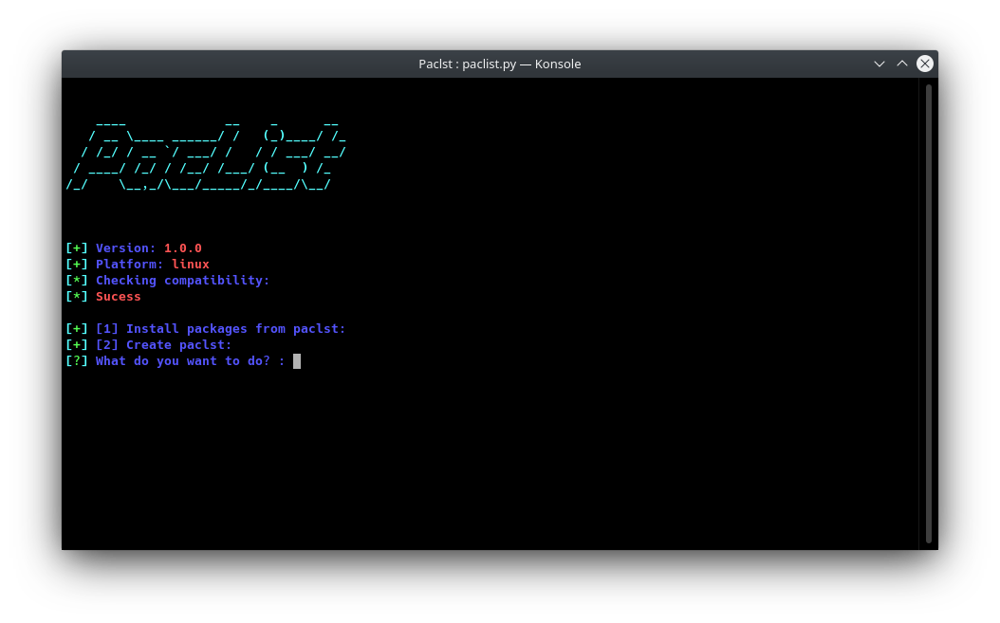

# PacList


__PacList - all package in one file!__

If you need to reinstall your OS, use PacList for save packages to file!

Now PacList avalible on ArchLinux, but we work to PacList make paclst to Ubuntu.

# How to use
```
git clone https://github.com/OneParsec/PacList
cd PacList
chmod 777 paclist.py
./paclist.py
```

# Screenshot


